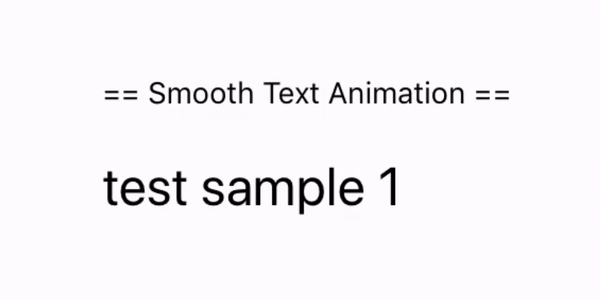

# react-native-loop-text

React Native component for smooth text animation like Shazam app


## 💻 Installation

`npm i react-native-loop-text  --save`

## 📖  Usage

```javascript
'use strict';

import React  from 'react';
import LoopText from 'react-native-loop-text';

const SomeComponent = () => {
    return (
      <LoopText textArray={["test_1","test_2"]}/>
    );
  }
}

export default SomeComponent;
```

Feel free to run or check the  [LoopTextSample](https://github.com/yelkamel/LoopTextSample) project.


## ℹ️ Props

only textArray is Required

| Params                     | Type          | Default | Description  |
| -------------------------- |:-------------:| ------- | ------------ |
| textArray                  | Array         |  -       | List of text to loop |
| delay                      | Number        | 4000    | Delay to swith text |
| duration                   | Number        | 1000    | Duration of the transition |

## 🤔 How to contribute
Have an idea? Found a bug? Please raise to [ISSUES](https://github.com/yelkamel/react-native-loop-text/issues).
Contributions are welcome and are greatly appreciated! 
Every little bit helps, and credit will always be given.
